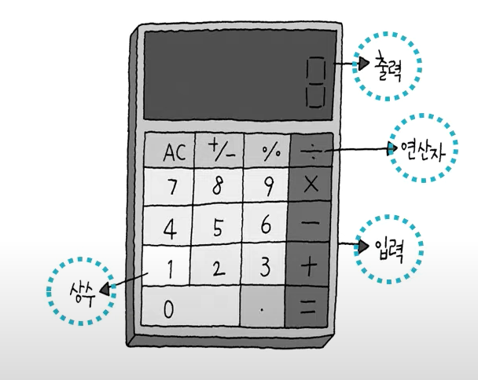
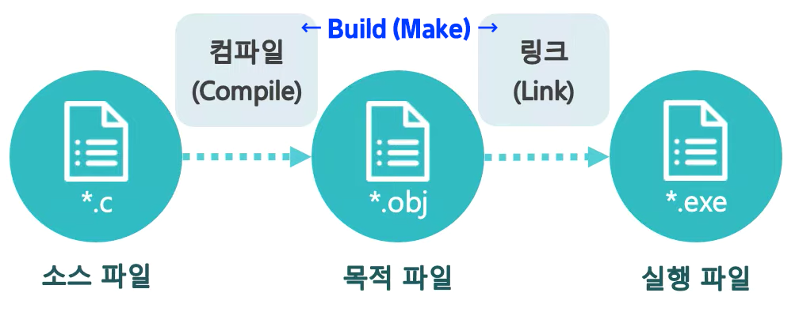
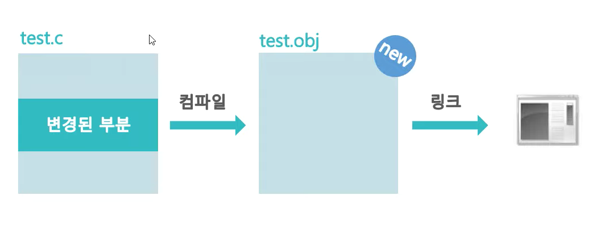
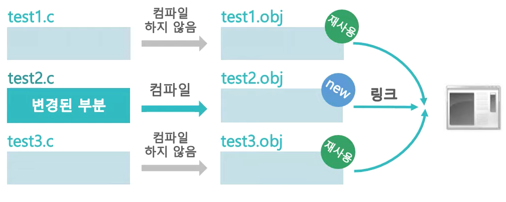

# Do It! C언어 입문 공부

---

## 1-1. 프로그래밍 기초

### 프로그램(Program)
  - 어떤 목적을 위해 진행 계획을 순서대로 표현한 것
  - 컴퓨터가 작업할 내용을 컴퓨터가 이해할 수 있는 언어(기계어)로 만들어진 파일

### 프로그래밍 언어
  - 컴퓨터는 2진 숫자로 이루어진 기계어를 사용
  - 사람에게 친숙한 표현법을 사용하여 프로그래밍을 할 수 있도록 만든 언어

### 컴파일러(Compiler)
   - 프로그래밍언어로 작성한 내용을 기계어로 번역
   - 프로그래밍 언어는 컴파일러와 약속된 표현을 사용

  #### `개발자` - `컴파일` - `컴퓨터`

<br>

## 1-2. C 언어의 소개

C언어는 1972년 켄 톰슨과 데니스 리피에 의해 개발 되었다.
기존에는 하드웨어의 변화에 마다 운영체제를 달리해야했는데, 이들은 이런 문제를 해소하고자 `UNIX`라는 독립적인 운영체제를 개발하기로 하였다. 이 과정에서 __C 언어__ 를 사용하였다.

### C 언어의 특징
  - 구조화된 언어 (Structured Language)
  - 이식성이 높다 (특정 하드웨어에서 다른 하드웨어로 옮겨 사용할 때 수정이 불필)
  - 확장성이 좋고 표현법이 다양하다
  - 생산성이 높다

  <br>

  ## 1-3. 전자계산기 원리와 프로그래밍 개념

  

  #### - 입력문 : 사용자가 원하는 정보 입력
  #### - 출력문 : 사용자에게 정보 표시
  #### - 살수 : 한정된 입력 대상
  #### - 연산자 : 연산 기능을 수행
  #### - 변수 : 입력한 값과 연산 결과를 기억하는 공간
  #### - 조건문 조건에 따른 처리가 가능하도록 제공되는 문법
  #### - 반복문 : 원하는 작업을 반복, 수행하도록 제공하는 문법


<br>

## 1-4. C 언어의 문장 서술 형식

### 단일 서술문

  논리적 최소 명령 실행 단위이며 __`; (세미콜론)`__ 으로 구분한다.

  ``` c
    a = a +30;      // 한 줄로 이루어진 단일 서술문
    a = a           // 두줄로 이루어진 단일 서술문
        + 30;
    a = a + 30; b = b + 50;         // 한 줄에 두 개의 단일 서술문을 사용
  ```

### 복합 서술문

  단일 서술문 여러 개를 하나로 묶은 형태
  __`{} 중괄호`__ 를 사용하여 표현하며, 중괄호 뒤에 ;(세미콜론)을 사용할 필요가 없다.

``` c
{
  a = a + 30;
  b = b + 50;
}
```
<br>

### 주석문
  소스 파일에 메모를 남기기 위해 사용한다.
  __`/* */`__ 기호를 사용하며, `/*` 로 시작하여 `*/` 로 끝난다.
  컴파일러가 번역할 때 주석문은 번역하지 않는다.

``` c
  /* a, b 의 평균값을 계산하여 average에 저장한다 */
  average = (a + b) / 2;
```

  주석문 사용 시 중첩하여 사용해선 안된다.

``` c
  /* 주석문은 /* 여러불에 걸쳐서도 */ 사용할수 있다 */
 시작        무시                끝        오류발생!
```

<br>

 ### 예약어
  프로그래밍 언어의 문법에서 사용되는 단어
  이름 짓는 문법에서는 예약어 사용이 불가능하다.
  __`main` `while` `char` `int` `for` `do while` `double` ...__

<br>

## 1-5. C 프로그램 실행 파일


  ### - 소스 파일 (*.c)
  프로그램을 c언어 문법을 사용해서 작성한 파일.
  ### - 목적 파일 (*.obj)
  소스 파일을 컴파일러가 컴파일하면 생성되는 파일.
  ### - 실행 파일 (*.exe)
  컴퓨터에서 실행할 수 있는 파일. 하나 이상의 목적 파일을 링커(Linker, 연결자)가 링크(Link, 연결) 하여 만든다.
<br>

  ### 소스 파일을 나누는 이유는?

  #### - 소스파일을 나누지 않는 경우
  
  위 그림같이 `test.c` 파일의 일부를 수정함에도 불구하고 `test.c`파일을 모두 다시한번 컴파일 한다. 매번 수정할 때 마다 전체 연산을 다시 하기 때문에 연산속도가 비효율적으로 변한다.

  #### - 소스파일을 나누는 경우
  

  위 그림같이 `test1.c`, `test2.c`, `test3.c` 로 소스파일을 나누고, `test2.c` 에서만 수정이 된다면 기존의 `test1.obj`와 `test3.obj` 두 목적 파일은 다시 재사용되고 수정된 `test2.obj` 만이 새로 컴파일되어 나온다. 따라서 컴퓨터에게는 연산 시간에 효율성 면에서 소스파일을 나누는것이 좋다.

  즉, __컴파일러는 변경된 소스 파일만 컴파일하여 목적파일로 만든다.__
