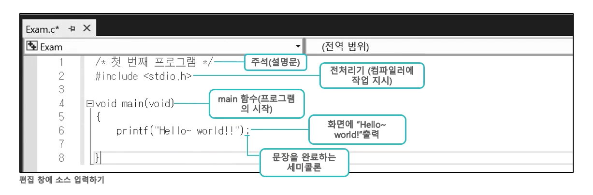

# Do It! C언어 입문 공부
---
## 2-1. 개발환경 구성

대충 visual studio community 설치한 다음 소스파일 추가 해서 환경 구성하자

## 2-2. Hello, world! 출력하기

```c
  /* 나의 첫번쨰 프로그램띠~*/
  #include <stdio.h>
  void main(void)
  {
    printf("Hello, world!");
  }
```



  #### include <stdio.h>
  C언어에서 #으로 시작하는 문장은 __전처리기__ 라고 한다.
  컴파일러에게 소스 코드를 번역 전에 명시한 파일을 먼저 참조하라고 지시하는 것이다.
  `printf` 함수에 대한 정보가 `stdio.h` 파일에 기록되어 있다.

  #### main
  - __함수(Function)__  
    명령들을 일정한 작업 단위로 묶어서 코드를 작성하기 위해 제공
    C 언어 ㅍ프로그램은 사용자가 만든 함수의 집랍체로 구성
    <br>
  - __`main`함수__
    프로그램 시작을 나타내므로 반드시 정의해야 함
    `main` 함수가 없거나, 2개 이상 선언하면 링크할 때 오류 발생
    함수는 서술문의 그룹으로 구성되므로 __{}(중괄호)__ 를 사용하여 영역을 표시한다.

  #### void

  -  '정해지지 않았다' 는 의미의 예약어이다. '없다' 의 의미로도 많이 사용한다.
  - __main 함수 앞 void__ : '함수의 수행 결과 값이 정해지지 않았다' 의 의미
  - __main 함수 뒤 void__ : 'main 함수로 전달되는 정보가 정해지지 않았다' 의 의미

  #### printf("Hello, world!");
  - `printf` 함수는 C 언어의 표준 출력 함수
  - 모니터 등의 콘솔 화면에 작성한 문자를 출력한다.
  - 뮨정 꿑에 ;(세미콜론) 반드시 작성할 것
