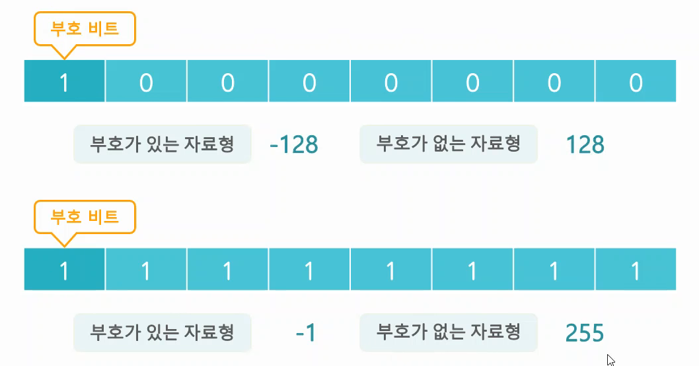
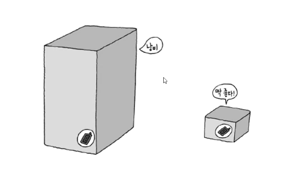

# Do It! C언어 입문 공부

---

# 자료형

## 3-1 데이터 저장 단위

  - __비트(bit)__ : 0 또는 1 두 가지 중 한 가지 값을 저장할 수 있는 단위
  - __바이트 (byte)__ : 8개의 비트로 구성된 저장 단위 (8 bit)
    __`_ _ _ _ _ _ _ _`__
    `2x2x2x2x2x2x2x2 = 2^8 = 256` (0~255 사이의 숫자 중 하나를 저장할 수 있는 단위)

  

  만약 운영체제가 32비트 운영체제라면, 32비트 단위로 메모리 주소를 처리한다. 따라서, 4 bytes = 32 bits 이므로, 4바이트를 처리할수 있는 __메모리의 크기__ 는 2^32 인 4GB 가 된다.

  즉, Window 32bit 운영체제를 사용한다면, RAM이 4GB 이상 처리를 못하기 때문에 그 이상은 필요가 없다.

  - __부호 비트__ : 양수와 음수를 구별하기 위한 비트

    
    - __양수의 표현 범위 : 0~127__
    - __음수의 표현 범위 : -128 ~ -1__
    - __부호의 개념을 가지는 1Byte 의 표현범위 : -128 ~ 127__
    <br>
    
    1000000[2] 는 부호가 있는 자료형이면 -128, 없는 자료형이면 128로 인식하고, 11111111[2] 는 부호가 있는 자료형이면 -1, 없는 자료형이면 255로 인식한다.

    ### 메모리 절약이 중요한 이유?
    
    스마트폰 포장 상자로 비유해보자. 스마트폰을 거대한 상자에 포장한다면 배달의 효율성이나 포장에 들어가는 비용 등 여러 부분에서 굉장히 비효율적이다. 반대로 스마트폰에 적절한 크기의 상자는 거대한 상자로 포장하는 것보다 효율적이고 합리적이다.

    프로그래밍 또한 같은 원리다. 같은 프로그램을 만들더라도 상대적으로 작은 크기로 처리할 수 있는 데이터를 더 크게 설정해버리면 메모리적으로 큰 낭비가 된다. (1Byte 짜리 데이터를 처리하기 위해 굳이 8Byte의 데이터형식을 사용 할 필요가 없다는 것이다.) 만일, _데이터 처리를 비효율적으로 개발한다면 이후 많이 쌓여진 데이터들은 메모리를 크게 낭비하게 될 것이니 유의하도록 하자!_
<br>
## 3-2. 아스키(ASCII)코드란?    
  ### ASCII(American Standard Code Information Interchange)
  
  컴퓨터에서 문자를 숫자로 표현하기 위한 약속이다. 컴퓨터는 문자를 인식을 못해서 사람들끼리 컴퓨터와 10진법, 16진법을 통해 문자를 숫자와 대조시킨 ASCII 코드를 약속하게 되었다. 굳이 다 외울 필요는 없느나 몇몇개는 알아두면 좋다하니 알아둬야겠다.
  10 | 16 | 문자
---|:--:|---:
0 | 0 | Null
48 | 30 | 0
65 | 41 | A
97 | 61 | a

## 3-3. 자료형은 왜 필요한가?

  __자료형__ : 실제로 메모리를 사용하는 단위

  - Built-in Data Type : 사용 빈도가 높은 자료형을 예약어로 제공
  - User-defined Data Type : 사용자가 만들어서 사용할 수 있는 문법 제공
  <br>
  - 정수형 자료형 :  C 언어 프로그램에서 정수 값을 메모리에 저장하기 위해 사용하는 자료형
  - 실수형 자료형 : C 언어 프로그램에서 실수 값을 메모리에 저장하기 위해 사용하는 자료형

  ### __정수를 표현하는 자료형__

  #### char

  - __signed char__ : 부호가 있는 1바이트 저장 공간
  ``` c
    signed char temperature;
    temperature = -2; /* 영하 2도를 temperature 변수에 저장함 */
  ```

  - __unsigned char__ : 부호가 없는 1바이트 저장 공간
  ``` c
    unsigned char age;
    age = 54; /* 나이 54살을 age 변수에 저장*/
  ```
  <br>

  #### short int

  - __signed short int__ : 부호가 있는 2바이트 저장 공간 (-32768 ~ 32767)
  ``` c
    signed short int dday;
    dday = -30 ; /* D-day가 -30이라고 dday 변수에 저장함 */
  ```
  - __unsigned short int__ : 부호가 없는 2바이트 저장 공간 (0 ~ 65535)
  ``` c
    unsigned short int seconds ;
    seconds = 40000; /* 40000초를 seconds 변수에 저장함*/
  ```

  #### long int

  - __signed long int__ : 부호가 있는 4바이트 저장 공간
    ``` c
      signed long int seaDepth_Meter;
      seaDepth_Meter = -300000; /* 심해 -300000을 변수 seaDepth_Meter 에 저장함 */
    ```
  - __unsigned long int__ : 부호가 없는 4바이트 저장 공간
    ``` c
      unsigned long int time_seconds;
      /* 1970년 1월 1일 부터 현재까지 시간을 초단위로 환산한 다음 time_seconds 변수에 저장함 */
      time_seconds = 145310624;
    ```

    

    _괄호 안의 오렌지 색은 생략 가능 (signed, unsigned는 생략 ㄴㄴ)_

  ### __정수를 표현하는 자료형__

  __부동소수점__ : 실수를 표현할 때 소수점의 위치를 고정하지 않고 소수점의 위치를 나타내는 수를 따로 작성하는 방식이 부동소수점(floating-point) 표현 방식이다.
  
  - __C 언어는 실수를 저장하기 위해 4바이트와 8바이트의 자료형을 제공한다.__

  __고정소수점__ : 일정한 위치에 소수점의 위치를 고정하여 숫자를 나열하는 방법
  - __`53.8 -> 000538000 / 123.45 -> 001234500 정수부와 소수부가 5칸씩 나눠가진다`__
  <br>
  C 언어는 더 많은 수를 표현하기 위해 부동소수점 방식을 사용한다
  

  프로그래밍 할때 실수형을 사용하는 경우는 불가피 하게 실수를 사용하거나 값의 정확도를 높이기 위해 사용한다. 범위가 큰 만큼 실수형은 연산속도가 느리기 때문에 굳이 쓸 필요가 없다면 쓰지 않도록 노력하자.
  (double형이 float형보다 무겁더라도 더욱 정확한 실수형을 저장할 수 있다. 유효숫자나 특정 정확성을 위한 상황에서는 double을 쓰기도 한다네...)
