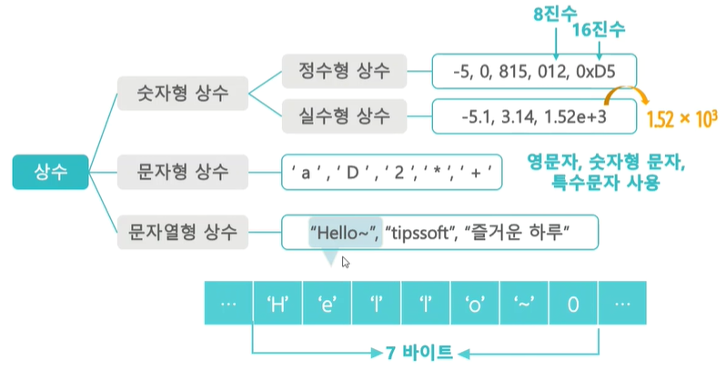
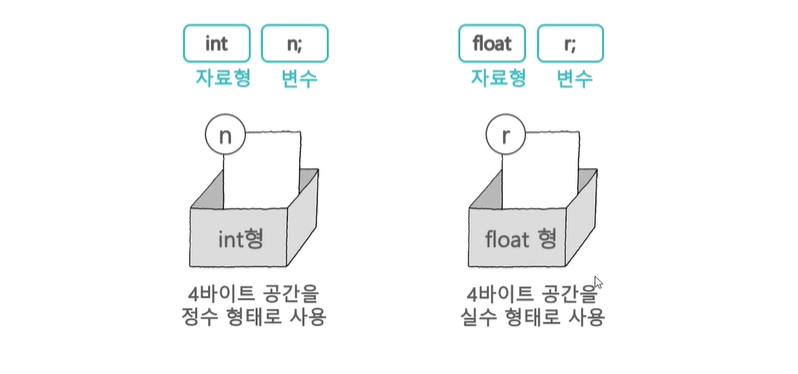
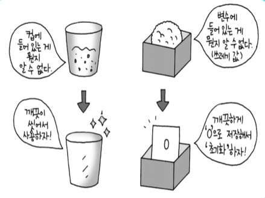
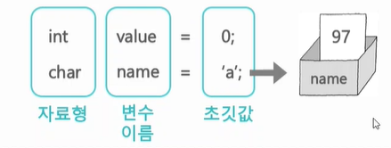
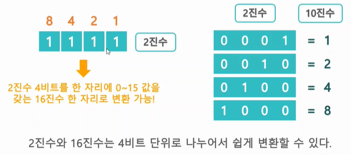
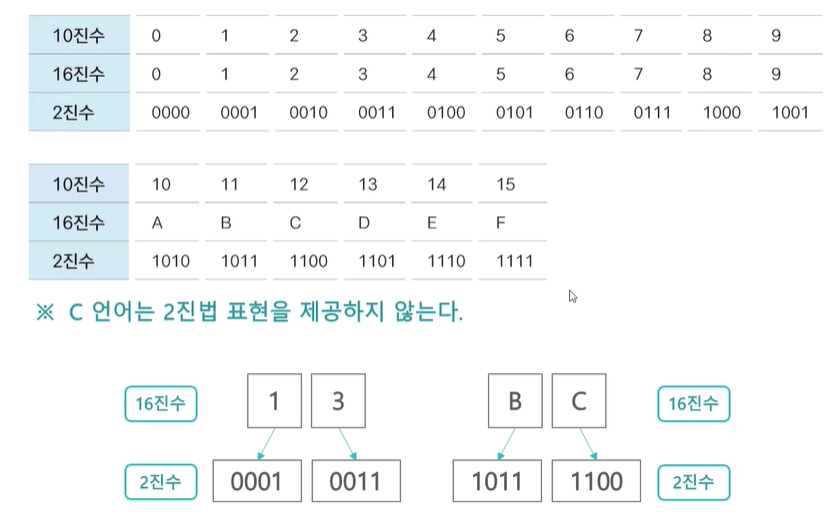

# Do It! C언어 입문 공부

---
# 상수와 변수

## 4-1. 항상 같은 수, 상수

__상수(Constant)__ 는 프로그램을 실행할 때 한 번 값이 결정되면 프로그램이 끝날 때 까지 다른 값으로 바뀌지 않는 정보이다.


__변수(Variable)__ : 변하는 값. 프로그램이 실행되는 동안 지속적으로 값이 바뀌는 정보, 사용자로부터 받은 데이터를 저장하거나 처리하는 저장 공간.



## 4-2. 데이터 저장 공간, 변수

- __변수 이름__ : 데이터가 저장되는 공간(메모리)을 가리키는 별명이다.
```c
    int number;
//자료형 변수이름
```

- __변수 이름 정할 때 기억할 것__
  1. 영문자 a~z, A~Z, 숫자 0~9 그리고 _(밑줄)을 사용할 수 있다.
  2. 숫자로 시작하거나 모두 숫자로 구성되어서는 안된다. `1000, 10_Times [x]`
  3. 공백을 포함할 수 없다. `user name [x]`
  4. 대,소문자를 구별한다. `name, Name, NAME, naMe 모두 다른 변 `
  5. C 언어의 예약어는 변수 이름으로 사용할 수 없다. `char main [x]`
<br>

- __변수 선언하기__ : 변수 선언은 저장 공간을 할당하는 것이다.
  ```c
    signed int num;
  // 자료형 변수이름 구분자(;)
  ```
  - 자신이 사용할 메모리 크기에 적합한 자료형을 지정하여 선언한다.
  - 변수 선언 문장 끝의 ;(세미콜론)은 구분자(Seperator)로서 사용된다.
  - 같은 자료형으로 여러 개의 변수를 선언할 때 ,(쉼표)를 사용하여 한줄로 선언할 수 있다.

  ``` c
    int data1;
    int data2;
    int data3;
        ↓
    int data1, data2, data3;
  ```
  <br>

- __변수 초기화하기__ : 변수를 사용하기 전 초깃값을 저장해서 깨끗하게 만드는 것을 초기화라고 한다.


변수를 선언하면서 초깃값을 대입하는 것을 __초기화__ 라고 한다.

``` c
  /* 4바이트 크기의 value 변수에 어떤 값이 저장되어 있는지 알 수 없음*/
  int value;

  // 쓰레기값 : 정리되지 않은 메모리에 들어있는 값

  /* 4 바이트 크기의 value 변수에 정수형 상수 값 0을 넣어 초기화 한다 */
  int value = 0;
  ```
  
  초깃값으로 'a' 를 넣으면 a의 ASCII 코드 값은 97 이기 때문에 97로 선언된다.

- __2진수를 16진수로 변환하는 방법__
  - 2진수 : 0, 1
  - 16진수 : 0, 1, 2, 3, 4, 5, 6, 7, 8, 9, A, B, C, D, E, F <br>
  16진수 한 자릿수는 4비트를 의미한다.
  
  <br>
  이후 16진법을 많이 쓴다고 하니 알아두면 좋을 듯 하다!
  
