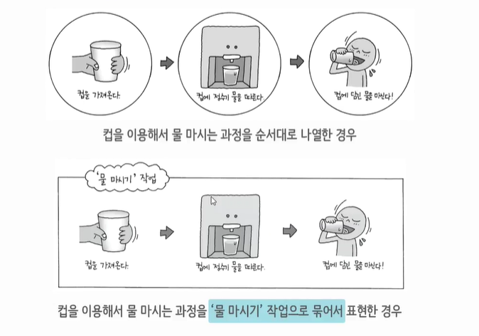
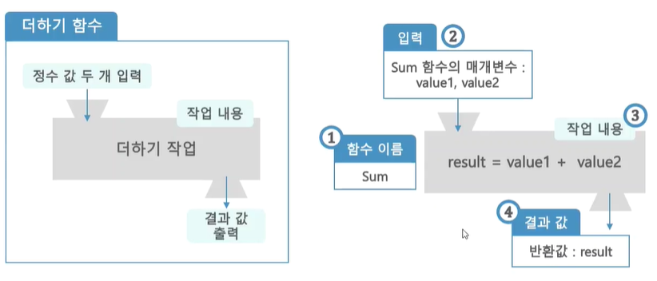

# Do It! C언어 입문 공부

---

# 함수

## 5-1. C 언어와 함수

####__함수가 필요한 이유__

`물 마시기 작업` 을 10번을 실행 할 때, 첫 번째 방식은 30개의 명령어를 써야하지만, 두 번째 방식은 처음 묶을 때 명령어 3번 쓴 뒤 묶은 명령(함수) 를 10번만 쓰면 된다. 또 `컵에 정수기 물을 따른다`명령어를 수정해야 하는 상황에서, 첫 번쨰 방식은 10개의 명령어를 모두 수정해야 하지만,` 물 마시기 작업`으로 묶은 경우에는 `물 마시기 작업` 한번만 수정 하면 되기때문에 효율적이다.

__함수(Function)란__ : 정해진 단위 작업을 수행하도록 명령문들을 하나의 그룹으로 묶은 것

  - 작업 별 그룹으로 나누어 소스코드를 작성하면 관리하기 편하다.
  - 소스 코드의 내용을 쉽게 이해 가능

``` c
물 마시기 (정수기)
{
  컵을 가져온다;
  컵에 정수기 물을 따른다;
  커벵 담긴 물을 마신다;
}
```

__함수 집합체__
  - C 언어로 작성한 프로그램은 함수의 집합체
  - C 언어의 소스 파일에는 꼭 하나 이상 함수가 존재
  - 함수들끼리 서로 호줄하여 사용하는 형태로 프로그램이 진행

__C 프로그램의 구조__

``` c
  Sum 함수 [3]
  {
    전달 받은 값들을 더해라. [4]
    더한 결과를 main 함수에게 돌려줘라 [5]
  }

  main 함수 [1]
  {
    더하긱 작업을 하는 Sum 함수를 불러라 (A, B 전달) [2]
    Sum 함수가 더해서 돌려준 결과 값을 출력해라. [6]
  }
```

<br>

## 5-2. 함수 정의하고 호출하기


1. __함수 이름__ : 하는 일을 짐작하기 쉽게 짓기
2. __매개변수__ : 작업을 수행 할 때 필요한 데이터가 잇다면 변수 단위로 명시
3. __작업 내용__ : 작업할 내용을 중괄호 {} 안에 명령문으로 나열
4. __반환값__ : 작업한 결과 값을 반환해야 할 때 사용
